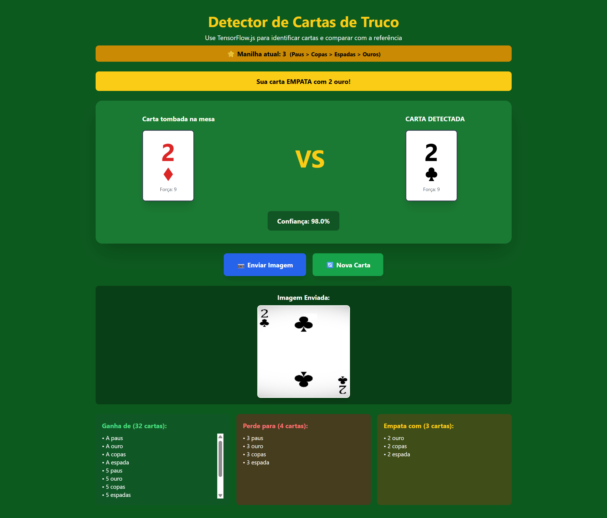

# 🃏 Detector de Cartas de Truco com TensorFlow.js

Sistema inteligente de detecção de cartas de baralho usando **IA com Teachable Machine** e **TensorFlow.js**, desenvolvido com **Next.js 14**, **TypeScript** e **Tailwind CSS**.



## 🤖 Sobre o Treinamento do Modelo

O modelo de detecção foi treinado usando o **Google Teachable Machine**, uma ferramenta gratuita e intuitiva que permite treinar modelos de Machine Learning sem necessidade de código:

- 🎯 **Plataforma**: [Google Teachable Machine](https://teachablemachine.withgoogle.com/)
- 📸 **Dados**: Fotos das 40 cartas de baralho (10 valores × 4 naipes)
- 🧠 **Arquitetura**: MobileNet v2 com Transfer Learning
- 📊 **Entrada**: Imagens 224x224 pixels
- 📦 **Saída**: Modelo exportado em TensorFlow.js

## 🎯 Funcionalidades

- 🤖 Detecção de cartas usando modelo de IA treinado com Teachable Machine
- 📸 Upload de imagens de cartas
- 🎴 Comparação automática com carta tombada na mesa (vira)
- ⭐ Sistema de manilhas dinâmico baseado na vira
- 📊 Análise detalhada: mostra quais cartas ganha, perde ou empata
- 🎨 Interface moderna e responsiva
- ⚡ Processamento em tempo real no navegador

## 🚀 Como Executar

### Pré-requisitos

- Node.js 18+ instalado
- npm ou yarn

### Instalação

1. Instale as dependências:

```bash
npm install
```

2. Execute o servidor de desenvolvimento:

```bash
npm run dev
```

3. Abra seu navegador em **http://localhost:3000** (ou outra porta se 3000 estiver ocupada)

## 📦 Estrutura do Projeto

O projeto segue princípios de **arquitetura limpa** com separação de responsabilidades:

```
├── app/                    # Next.js App Router
│   ├── layout.tsx          # Layout principal
│   ├── page.tsx            # Página inicial
│   └── globals.css         # Estilos globais
├── components/             # Componentes de UI (Puros/Dumb)
│   ├── Card/               # Componente de carta
│   ├── CardAnalysis/       # Análise detalhada
│   ├── CardComparison/     # Smart Component (orquestrador)
│   ├── ConfidenceBadge/    # Badge de confiança
│   └── UploadedImage/      # Display de imagem
├── hooks/                  # Hooks customizados reutilizáveis
│   ├── useCardModel.ts     # Gerenciamento do modelo TensorFlow
│   ├── useCardDetection.ts # Detecção de cartas
│   └── useCardComparison.ts # Comparação de cartas
├── services/               # Lógica de serviços externos
│   └── cardDetectionService.ts # Serviço de detecção com TensorFlow
├── types/                  # Definições TypeScript globais
│   └── card.ts             # Tipos relacionados a cartas
├── utils/                  # Funções utilitárias e helpers
│   └── fileUtils.ts        # Manipulação de arquivos
├── lib/                    # Lógica de negócio
│   └── trucoLogic.ts       # Regras do jogo de Truco
├── public/
│   └── modelo_treinado/    # Modelo TensorFlow.js (do Teachable Machine)
│       ├── model.json      # Arquitetura do modelo
│       └── metadata.json   # Metadados (labels das 40 cartas)
├── ARCHITECTURE.md         # Documentação da arquitetura
├── package.json
└── README.md
```

## 🎮 Como Usar

1. **Ao abrir a aplicação**, uma carta será tombada na mesa (vira) aleatoriamente
   - A vira define qual é a **manilha** (carta seguinte à vira)
   - Por exemplo: se a vira é **5**, a manilha é **6**

2. **Clique em "📸 Enviar Imagem"** para fazer upload de uma foto de carta

3. O modelo de IA treinado com **Teachable Machine** irá **detectar qual carta** você enviou

4. O sistema mostrará:
   - Se sua carta **ganha**, **perde** ou **empata** com a carta tombada na mesa
   - Nível de **confiança** da detecção (%) 
   - **Manilha atual** e hierarquia de naipes
   - Lista de cartas que sua carta **ganha**
   - Lista de cartas que sua carta **perde**
   - Lista de cartas que sua carta **empata**

5. **Clique em "🔄 Nova Carta"** para tombar uma nova carta na mesa

## 🃏 Cartas Reconhecidas

O modelo reconhece **40 cartas** do baralho de Truco:

- **Valores**: A (Ás), 2, 3, 4, 5, 6, 7, Q (Dama), J (Valete), K (Rei)
- **Naipes**: Paus (♣), Ouro (♦), Copas (♥), Espadas (♠)

## 📊 Hierarquia de Força no Truco

### Cartas Normais (do mais fraco ao mais forte):

1. 4 (força 1) - mais fraca
2. 5 (força 2)
3. 6 (força 3)
4. 7 (força 4)
5. Q - Dama (força 5)
6. J - Valete (força 6)
7. K - Rei (força 7)
8. A - Ás (força 8)
9. 2 (força 9)
10. 3 (força 10) - carta normal mais forte

### ⭐ Manilhas (cartas especiais):

A **manilha** é a carta imediatamente seguinte à **vira** (carta tombada na mesa).

**Hierarquia de Manilhas por Naipe**:
1. **Paus ♣** (força 14) - Zap (mais forte)
2. **Copas ♥** (força 13)
3. **Espadas ♠** (força 12) - Espadilha
4. **Ouro ♦** (força 11) - mais fraca

**Exemplo**: Se a vira é **7**, a manilha é **Q** (Dama):
- Q de Paus = força 14 (mais forte)
- Q de Copas = força 13
- Q de Espadas = força 12
- Q de Ouro = força 11

⚠️ **Importante**: Manilhas NUNCA empatam entre si, pois têm naipes diferentes!

## 🤖 Tecnologias Utilizadas

### Frontend
- **Next.js 14** - Framework React com App Router
- **TypeScript** - Tipagem estática para maior segurança
- **Tailwind CSS** - Estilização utilitária
- **React Hooks** - Gerenciamento de estado moderno

### Machine Learning
- **Google Teachable Machine** - Plataforma para treinar o modelo sem código
- **TensorFlow.js** - Execução do modelo no navegador
- **MobileNet v2** - Arquitetura de rede neural (transfer learning)

### Arquitetura
- **Clean Architecture** - Separação de responsabilidades
- **Custom Hooks** - Lógica reutilizável
- **Service Layer** - Encapsulamento de integrações
- **Pure Components** - Componentes sem side effects

## 🧠 Detalhes do Modelo de IA

### Treinamento com Teachable Machine

O modelo foi treinado usando o **[Google Teachable Machine](https://teachablemachine.withgoogle.com/)**, uma ferramenta que simplifica o processo de Machine Learning:

**Características do Modelo**:
- **Plataforma**: Google Teachable Machine (gratuita)
- **Arquitetura**: MobileNet v2 com Transfer Learning
- **Input**: Imagens 224x224 pixels RGB
- **Classes**: 40 (10 valores × 4 naipes)
- **Framework**: TensorFlow.js (executa no navegador)
- **Tamanho**: Otimizado para web (~5MB)

**Processo de Treinamento**:
1. Coleta de imagens das 40 cartas diferentes
2. Upload das imagens no Teachable Machine
3. Organização em classes (uma para cada carta)
4. Treinamento automático do modelo
5. Exportação em formato TensorFlow.js
6. Integração no projeto Next.js

## 📸 Dicas para Melhor Detecção

Para obter os melhores resultados:

- Use imagens com **boa iluminação**
- Mantenha a carta **centralizada** na foto
- Evite **reflexos** ou sombras fortes
- Use fundo **contrastante** com a carta
- Tire fotos com a carta **plana** (não dobrada)

## 🛠️ Customização

### Treinar um Novo Modelo com Teachable Machine

**Passo a passo completo**:

1. **Acesse** [Teachable Machine](https://teachablemachine.withgoogle.com/)

2. **Escolha** "Image Project" → "Standard image model"

3. **Crie 40 classes** (uma para cada carta):
   - Nomeie cada classe: "A paus", "A ouro", "A copas", "A espada", etc.

4. **Adicione fotos** de cada carta em sua respectiva classe:
   - Recomendado: 50-100 imagens por classe
   - Varie ângulos, iluminação e distância
   - Use fundos diferentes

5. **Treine o modelo**:
   - Clique em "Train Model"
   - Aguarde o treinamento (alguns minutos)
   - Teste a precisão com a webcam ou novas imagens

6. **Exporte** como "TensorFlow.js":
   - Clique em "Export Model"
   - Escolha "TensorFlow.js"
   - Faça upload ou baixe os arquivos

7. **Substitua** os arquivos em `public/modelo_treinado/`:
   - `model.json` - arquitetura
   - `weights.bin` - pesos treinados  
   - `metadata.json` - labels das classes

### Modificar a Lógica de Força

Edite o arquivo [lib/trucoLogic.ts](lib/trucoLogic.ts) e ajuste os valores no objeto `VALORES_BASE`.

## 🔧 Resolução de Problemas

### Modelo não carrega

- Verifique se a pasta `public/modelo_treinado/` contém os arquivos:
  - `model.json`
  - `weights.bin`
  - `metadata.json`

### Detecção com baixa confiança

- Certifique-se de usar imagens semelhantes às usadas no treinamento
- Considere retreinar o modelo com mais exemplos

### Erro de CORS

- Certifique-se de que os arquivos do modelo estão na pasta `public/`
- Reinicie o servidor de desenvolvimento

## 📝 Licença

Este projeto foi criado para fins educacionais.

## 🙋 Suporte

Para problemas ou dúvidas:

1. Verifique o console do navegador (F12)
2. Confirme que todas as dependências foram instaladas
3. Certifique-se de que o modelo está na pasta correta

---

Desenvolvido com ❤️ usando Next.js, TypeScript e TensorFlow.js
