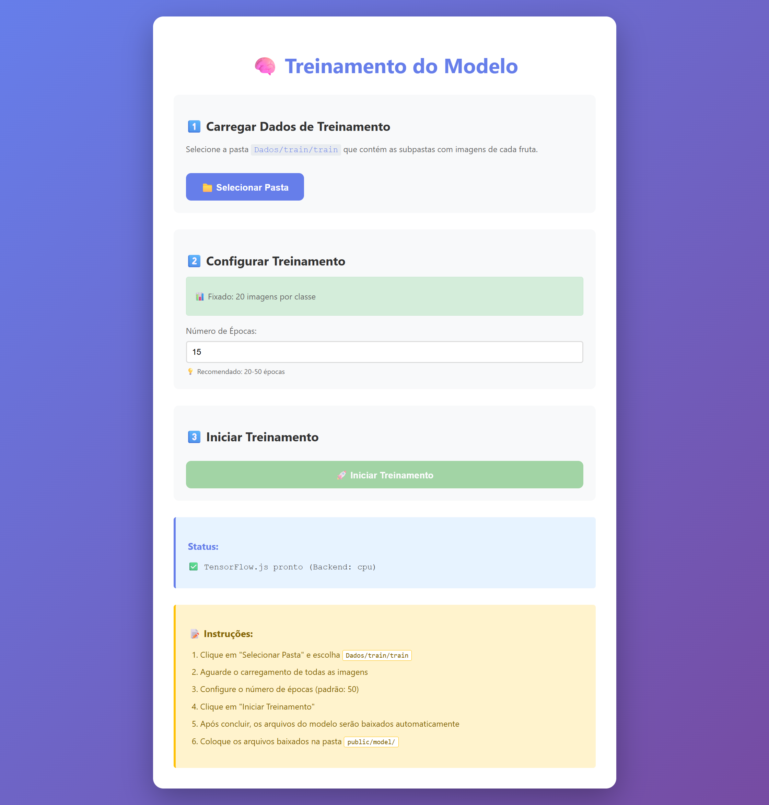
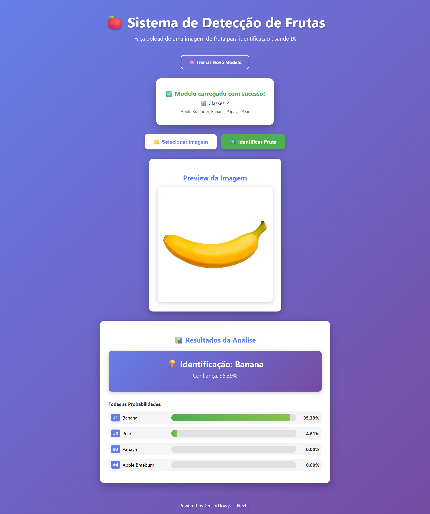

# 🍎 Fruit Detection System (TensorFlow.js + Next.js)

Sistema de reconhecimento de frutas usando **TensorFlow.js** e **Next.js** com redes neurais convolucionais (CNN). Treinamento e predição 100% no navegador - sem necessidade de Python ou compiladores nativos!

## 📊 Dataset

Este projeto foi testado com o dataset de frutas do Kaggle: [Image Classification using CNN - Fruits](https://www.kaggle.com/code/rafetcan/image-classification-using-cnn-fruits)

**Configuração de Teste:**
- **4 classes**: Apple Braeburn, Banana, Papaya, Pear
- **20 imagens por classe** (80 imagens totais)
- **15 épocas de treinamento**
- Tempo de treinamento: ~2-7 minutos (CPU)

O dataset original contém 33 tipos diferentes de frutas, mas para testes rápidos recomendamos começar com 4-9 classes.

## ✨ Características

- 🚀 **Sem dependências nativas** - funciona em qualquer Windows
- 🧠 **Treinamento no navegador** - interface visual para treinar o modelo
- 📊 **Configurável** - testado com 4 classes, suporta até 33 tipos de frutas
- 🎯 **Predição em tempo real**
- 💻 **100% JavaScript** - não precisa de Python
- ⚡ **Otimizado para navegadores** - arquitetura CNN simplificada

## 🚀 Início Rápido

### 1. Instalar Dependências

```powershell
npm install
```

### 2. Iniciar Aplicação

```powershell
npm run dev
```

Acesse: http://localhost:3000

## 🎓 Como Treinar o Modelo

### Interface Web (Recomendado)

1. Inicie a aplicação: `npm run dev`
2. Acesse: http://localhost:3000/train
3. Clique em "Selecionar Pasta" e escolha `Dados/train/train`
4. Configure o número de épocas (padrão: 15)
5. Clique em "Iniciar Treinamento"
6. Aguarde o treinamento concluir
7. Os arquivos do modelo serão baixados automaticamente
8. Volte para a página inicial e carregue o modelo



### ⏱️ Tempo de Treinamento Estimado

Com a configuração testada (4 classes, 20 imagens/classe, 15 épocas):
- **CPU moderna**: 2-7 minutos
- **CPU antiga**: 5-15 minutos

Status da página durante o treinamento:
- ✅ Interface permanece responsiva
- 📊 Atualização em tempo real de cada época
- 🔄 Barra de progresso visual

### Estrutura de Dados Necessária

```
Dados/
  train/
    train/
      Apple Braeburn/
        imagem1.jpg
        imagem2.jpg
        ... (20 imagens)
      Banana/
        imagem1.jpg
        ... (20 imagens)
      Papaya/
        ... (20 imagens)
      Pear/
        ... (20 imagens)
```

**Nota:** O sistema foi testado com 4 classes e 20 imagens por classe. Você pode adicionar mais classes conforme necessário. O dataset original contém 33 tipos de frutas.

## 🖥️ Como Usar o Sistema de Predição

1. Acesse http://localhost:3000
2. Clique em "📁 Carregar Modelo" e selecione os 3 arquivos:
   - `fruit-model.json`
   - `fruit-model.weights.bin`
   - `classes.json`
3. Aguarde a confirmação de carregamento
4. Clique em "Selecionar Imagem"
5. Escolha uma foto de fruta
6. Clique em "Identificar Fruta"
7. Visualize os resultados com probabilidades



**Nota:** O modelo pode ser carregado via upload ou colocado em `public/model/` para carregamento automático.

## 🍓 Frutas Suportadas

### Testado com 4 Classes:
- 🍎 **Apple Braeburn**
- 🍌 **Banana**
- 🥭 **Papaya**
- 🍐 **Pear**

### Dataset Completo (33 tipos disponíveis):
- Apple Braeburn, Apple Granny Smith
- Apricot, Avocado, Banana, Blueberry
- Cactus fruit, Cantaloupe, Cherry, Clementine
- Corn, Cucumber Ripe, Grape Blue
- Kiwi, Lemon, Limes, Mango
- Onion White, Orange, Papaya, Passion Fruit
- Peach, Pear, Pepper Green, Pepper Red
- Pineapple, Plum, Pomegranate, Potato Red
- Raspberry, Strawberry, Tomato, Watermelon

**Dica:** Comece com 4-9 classes para testes rápidos, depois expanda gradualmente.

## 📁 Estrutura do Projeto

```
DetectarTensorflow/
├── Dados/                      # Dados de treinamento
│   ├── train/train/           # Imagens organizadas por classe
│   └── test/test/             # Imagens de teste
├── pages/                      # Páginas Next.js
│   ├── _app.js                # Configuração do app
│   ├── _document.js           # Estrutura HTML
│   ├── index.js               # Página de predição
│   └── train.js               # Página de treinamento
├── public/                     # Arquivos públicos
│   └── model/                 # Modelo treinado (criar após treinar)
├── styles/                     # Estilos CSS
│   ├── globals.css
│   ├── Home.module.css
│   └── Train.module.css
├── package.json               # Dependências
├── next.config.js             # Configuração Next.js
└── README.md                  # Este arquivo
```

## 🔧 Tecnologias

- **Next.js 14** - Framework React
- **TensorFlow.js 4.15** - Machine Learning no navegador
- **React 18** - Interface do usuário
- **CSS Modules** - Estilização

## 🧠 Arquitetura do Modelo CNN

**Arquitetura Simplificada (Otimizada para Navegador):**

```
Input (128x128x3)
    ↓
Conv2D (16 filters, 3x3) + ReLU + MaxPooling (2x2)
    ↓
Conv2D (32 filters, 3x3) + ReLU + MaxPooling (2x2)
    ↓
Flatten
    ↓
Dense (64 units) + ReLU + Dropout (0.3)
    ↓
Dense (4 units*) + Softmax
    
* Número de classes ajustável
```

**Otimizações implementadas:**
- ✅ Imagens redimensionadas para 128x128 (vs 224x224) - economia de memória
- ✅ Apenas 2 camadas convolucionais (vs 3) - treinamento mais rápido
- ✅ Menos filtros (16, 32 vs 32, 64, 128) - menor uso de GPU/CPU
- ✅ Camada densa menor (64 vs 256 neurônios) - processamento mais leve
- ✅ Batch size de 16 - melhor para navegadores
- ✅ Learning rate aumentado (0.003) - convergência mais rápida

**Resultado:** Treinamento 3-4x mais rápido com boa acurácia!

## 🐛 Solução de Problemas

### Modelo não carrega na página de predição
1. Certifique-se de que treinou o modelo em `/train`
2. Verifique se os arquivos estão em `public/model/`
3. Deve ter: `model.json`, `classes.json` e arquivos `.bin`

### Treinamento muito lento
- O treinamento acontece no navegador usando GPU/CPU local
- Depende do hardware do seu computador
- **Dica**: Reduza o número de épocas para 20-30 para testes
- Ou use menos imagens por classe inicialmente

### Erro ao selecionar pasta no treinamento
- **Navegador recomendado**: Chrome ou Edge
- Firefox pode ter limitações com seleção de pastas
- Safari não suporta bem essa funcionalidade

### Aviso de vulnerabilidades no npm
- Avisos deprecados são normais e não impedem o funcionamento
- São dependências transitivas que não afetam o projeto
- Pode ignorar com segurança

## 📈 Dicas para Melhor Acurácia

1. **Mais dados**: Use pelo menos 100-200 imagens por classe
2. **Imagens variadas**: Diferentes ângulos, iluminações, backgrounds
3. **Qualidade**: Imagens nítidas e bem enquadradas
4. **Balanceamento**: Número similar de imagens por classe
5. **Épocas**: 50-100 épocas geralmente dão bons resultados
6. **Validação**: Reserve 20% dos dados para validação

## 🚀 Deploy para Produção

### Vercel (Recomendado)

1. Faça upload do projeto no GitHub
2. Acesse https://vercel.com
3. Conecte seu repositório
4. Aguarde o build automático
5. Seu app estará online!

**Importante**: Treine o modelo localmente e inclua a pasta `public/model/` no repositório.

## 📝 Modo Produção Local

```powershell
npm run build
npm start
```

Acesse: http://localhost:3000

## 💡 Próximas Melhorias

- [ ] Data augmentation (rotação, zoom, flip)
- [ ] Transfer learning (MobileNet)
- [ ] **Web Workers** - Mover processamento pesado para thread separada para não travar a UI
- [ ] Suporte a múltiplas frutas na mesma imagem
- [ ] API REST para predições em lote
- [ ] Histórico de predições
- [ ] Exportar relatórios
- [ ] GPU acceleration com WebGL backend

### 🔧 Otimização com Web Workers

Uma das principais melhorias sugeridas é implementar **Web Workers** para:

- **Treinamento em background**: Mover o treinamento do modelo para um Web Worker evita que a página trave durante o processo
- **Pré-processamento de imagens**: Processar múltiplas imagens em paralelo
- **Predições em lote**: Processar várias predições simultaneamente sem bloquear a UI
- **Melhor experiência do usuário**: Interface permanece responsiva durante operações pesadas

**Implementação sugerida:**
```javascript
// Criar Web Worker para treinamento
const trainingWorker = new Worker('training-worker.js');
trainingWorker.postMessage({ images, labels, config });
trainingWorker.onmessage = (e) => {
  // Receber progresso e resultados
  updateUIWithProgress(e.data);
};
```

## 📄 Licença

Projeto educacional para fins de aprendizado em IA e Machine Learning.

## 📊 Créditos

**Dataset:** [Image Classification using CNN - Fruits](https://www.kaggle.com/code/rafetcan/image-classification-using-cnn-fruits) - Kaggle

## 🤝 Contribuições

Sinta-se à vontade para abrir issues ou pull requests!

---

**Desenvolvido com ❤️ usando TensorFlow.js e Next.js**
