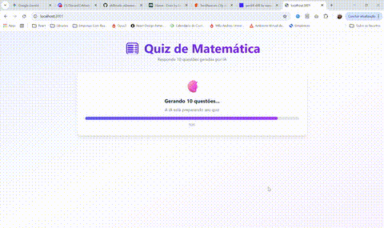
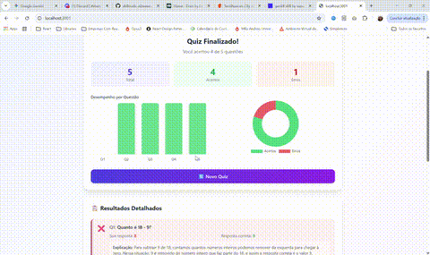

# 🧮 Quiz de Matemática com IA (Next.js + Genkit + Ollama)

> **Aplicação web de quiz de matemática com geração de questões por IA local (Ollama + Genkit), validação matemática robusta, gráficos interativos e renderização de fórmulas matemáticas.**

## 🎬 Demonstração





## 🚀 Visão Geral

Este projeto demonstra como integrar IA generativa local (Ollama via Genkit) em uma aplicação Next.js para criar quizzes de matemática dinâmicos, seguros e didáticos. O sistema é modular, validado e pronto para uso educacional.

## ✨ Funcionalidades

- **Geração automática de 5 questões** de matemática por IA local
- **3 níveis de dificuldade**: Fácil, Médio, Difícil
- **Tópicos personalizáveis**: aritmética, álgebra, frações, geometria, etc.
- **Validação rigorosa**: só exibe questões e alternativas válidas e únicas
- **Renderização de fórmulas matemáticas**: via [react-katex](https://katex.org/)
- **Gráficos de desempenho**: barras e rosca com [Chart.js](https://www.chartjs.org/)
- **Explicações didáticas**: IA justifica cada resposta
- **Arquitetura modular**: serviços separados para IA, matemática, tipos e helpers
- **Skills Genkit**: integração com plugins e modelos via Genkit

## 🛠️ Tecnologias

- **Frontend**: Next.js 14, React 18, TypeScript, Tailwind CSS
- **IA/LLM**: [Genkit](https://github.com/genkit-dev/genkit) + [Ollama](https://ollama.com/) (llama3.2)
- **Gráficos**: Chart.js 4 + react-chartjs-2
- **Matemática**: mathjs
- **Renderização matemática**: react-katex

## 📦 Pré-requisitos

1. **Node.js** 18+
2. **Ollama** instalado e rodando localmente
3. **Modelo llama3.2** baixado no Ollama

### Instalação do Ollama

```bash
# Windows: baixe em https://ollama.com/download
ollama pull llama3.2
```

### Verificação

```bash
ollama list
# Deve mostrar: llama3.2:latest
```

## ⚡ Instalação e Execução

```bash
cd Quiz
npm install
npm run dev
```

Acesse: [http://localhost:3001](http://localhost:3001)

## 📁 Estrutura Modular do Projeto

```
Quiz/
├── lib/
│   └── genkit.ts              # Configuração do Genkit + Ollama
├── pages/
│   ├── _app.tsx
│   ├── index.tsx
│   └── api/
│       └── quiz.ts            # API modularizada do quiz
├── src/
│   ├── components/
│   │   ├── QuizConfig/
│   │   ├── QuizDetails/
│   │   ├── QuizLoading/
│   │   ├── QuizQuestion/
│   │   ├── QuizResults/
│   │   └── MathRender.tsx     # Renderização de fórmulas matemáticas
│   ├── contexts/QuizContext.tsx
│   ├── hooks/useQuizActions.ts
│   ├── services/
│   │   ├── quizService.ts     # Orquestra lógica do quiz
│   │   ├── quizAiHelpers.ts   # Geração/explicação por IA
│   │   ├── quizMathHelpers.ts # Validação matemática
│   │   └── quizTypes.ts       # Tipos do quiz
│   ├── utils/quizConstants.ts
│   └── utils/quizHelpers.ts
├── styles/globals.css
├── package.json
└── tailwind.config.js
```

## 🧠 Skills Genkit e Integração IA

- **Genkit**: Orquestra prompts, plugins e modelos de IA (Ollama)
- **Ollama**: Geração local de questões e explicações (sem dependência de nuvem)
- **Prompt Engineering**: Persona, contexto, restrições e few-shot para garantir qualidade
- **Validação**: Só aceita questões com 4 alternativas únicas e resposta correta presente

Exemplo de configuração (`lib/genkit.ts`):

```typescript
import { genkit } from "genkit";
import { ollama } from "genkitx-ollama";

export const ai = genkit({
  plugins: [ollama({ serverAddress: "http://127.0.0.1:11434" })],
  model: "ollama/llama3.2",
});
```

## 🎮 Como Usar

1. **Configure**: Escolha dificuldade e tópico
2. **Inicie**: Clique em "Iniciar Quiz"
3. **Aguarde**: IA gera questões validadas
4. **Responda**: Selecione alternativas (fórmulas renderizadas)
5. **Veja Resultados**: Gráficos, acertos/erros e explicações didáticas

## 📊 API Modularizada

### POST /api/quiz

- `generateBatch`: Gera lote de questões
- `generate`: Gera uma questão
- `evaluate`: Avalia resposta

**Exemplo:**

```json
{
  "action": "generateBatch",
  "difficulty": "easy|medium|hard",
  "topic": "aritmética",
  "count": 5
}
```

## 🧩 Arquitetura Modular

- **quizService.ts**: Orquestra geração, validação e avaliação
- **quizAiHelpers.ts**: Geração/explicação por IA (Genkit)
- **quizMathHelpers.ts**: Validação matemática (mathjs)
- **quizTypes.ts**: Tipos TypeScript
- **MathRender.tsx**: Renderização de fórmulas matemáticas (react-katex)
- **chartjs-setup.ts**: Registro de escalas Chart.js

## 🎨 Experiência do Usuário

- **Configuração**: Escolha dificuldade/tópico
- **Carregamento**: Barra de progresso
- **Quiz**: 5 questões, alternativas validadas, fórmulas renderizadas
- **Resultados**: Gráficos interativos, detalhamento, explicações

## 📝 Observações

- Só são exibidas questões válidas (4 alternativas únicas, resposta correta presente)
- Fallback amigável para questões inválidas
- Gráficos e fórmulas matemáticas renderizados de forma robusta
- Skills Genkit permitem fácil extensão para outros modelos/plugins

## 📄 Licença

Projeto educacional para fins de demonstração em IA Aplicada.

# 🧮 Quiz de Matemática com IA

Aplicação web de quiz de matemática que utiliza IA generativa (Ollama + Genkit) para criar questões personalizadas e avaliar respostas dos estudantes.

## 📋 Sobre o Projeto

Este projeto foi desenvolvido como parte do **Módulo 6 - IA Aplicada** para demonstrar a integração de modelos de linguagem locais (Ollama) em uma aplicação web educacional.

### Funcionalidades

- ✨ **Geração de 5 questões** de matemática por IA
- 🎯 **3 níveis de dificuldade**: Fácil, Médio e Difícil
- 📚 **Tópicos personalizáveis**: aritmética, álgebra, frações, geometria, etc.
- 📊 **Gráficos de desempenho**: barras e rosca para visualização dos resultados
- 📝 **Explicações didáticas**: justificativa para cada resposta correta
- 🔄 **Quiz completo**: responda todas as 5 questões antes de ver os resultados

## 🛠️ Tecnologias Utilizadas

- **Frontend**: Next.js 14, React 18, TypeScript, Tailwind CSS
- **IA/LLM**: Firebase Genkit + Ollama (llama3.2)
- **Gráficos**: Chart.js + react-chartjs-2
- **Matemática**: mathjs

## 📦 Pré-requisitos

1. **Node.js** 18+ instalado
2. **Ollama** instalado e rodando
3. **Modelo llama3.2** baixado no Ollama
