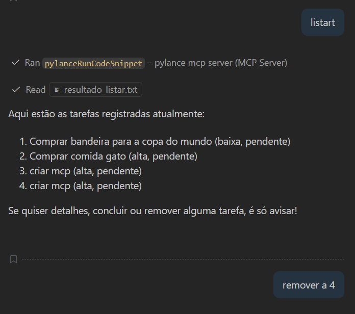

# 📋 Gestor de Tarefas - FastMCP

Sistema completo de gestão de tarefas construído com FastMCP (Model Context Protocol).



## 🎯 Sobre o Projeto

Este é um servidor MCP completo que demonstra os três pilares do protocolo:

- **Tools (Ferramentas)**: Ações que modificam o estado do sistema
- **Resources (Recursos)**: Fontes de dados para consulta
- **Prompts (Instruções)**: Templates para orientar o comportamento da IA

## 🚀 Instalação

```bash
# Instalar dependências
pip install -r requirements.txt
```

## �️ Executando o Servidor

```bash
# Modo standalone
python server.py

# Com Claude Desktop
# Configure o .mcp.json e inicie via Claude Code
```

Ao executar, o servidor:

- ✅ Cria `tarefas.json` se não existir
- ✅ Expõe tools, resources e prompts via MCP
- ✅ Persiste alterações automaticamente

## �📂 Estrutura do Projeto

```
gestor_tarefas/
├── server.py          # Servidor MCP principal
├── tarefas.json       # Base de dados (JSON)
├── requirements.txt   # Dependências
├── test_server.py     # Script de testes
└── README.md          # Esta documentação
```

## 🛠️ Funcionalidades

### Tools (Ferramentas)

1. **adicionar_tarefa(titulo, descricao, prioridade)**
   - Adiciona uma nova tarefa ao sistema
   - Prioridade: alta, média ou baixa

2. **concluir_tarefa(id_tarefa)**
   - Marca uma tarefa como concluída

3. **remover_tarefa(id_tarefa)**
   - Remove uma tarefa do sistema

4. **buscar_por_prioridade(prioridade)**
   - Busca tarefas por nível de prioridade

5. **listar_tarefas()**
   - Lista todas as tarefas cadastradas

### Resources (Recursos)

1. **memory://tarefas/todas**
   - Lista todas as tarefas cadastradas

2. **memory://tarefas/estatisticas**
   - Retorna estatísticas sobre as tarefas

### Prompts (Instruções)

1. **criar_relatorio_semanal()**
   - Gera prompt para relatório executivo semanal

2. **sugerir_priorizacao()**
   - Gera prompt para sugestão de ordem de execução

## 🎮 Como Usar

### Executar o Servidor

```bash
python server.py
```

### Executar os Testes

```bash
python test_server.py
```

## 💡 Exemplos de Uso

### Cenário 1: Criando Tarefas

```python
# A IA pode executar:
adicionar_tarefa(
    titulo="Revisar código",
    descricao="Revisar PR #234 do backend",
    prioridade="alta"
)
# Resultado: ✅ Tarefa #1 criada com sucesso: Revisar código
```

### Cenário 2: Consultando Recursos

```python
# A IA acessa o resource:
# memory://tarefas/estatisticas
# Retorna:
# 📊 **ESTATÍSTICAS DO SISTEMA**
# Total de tarefas: 5
# ✅ Concluídas: 2 (40.0%)
# ⏳ Pendentes: 3
```

### Cenário 3: Usando Prompts

```python
# A IA usa o prompt:
criar_relatorio_semanal()
# Recebe instruções estruturadas para gerar relatório
```

## 📊 Estrutura de Dados

Cada tarefa possui:

```json
{
  "id": 1,
  "titulo": "Título da tarefa",
  "descricao": "Descrição detalhada",
  "prioridade": "alta",
  "status": "pendente",
  "criada_em": "2026-02-17T10:30:00",
  "concluida_em": null
}
```

## 🧪 Testes

O projeto inclui testes abrangentes:

- ✅ Fluxo básico de operações
- ✅ Cenários de interação com IA
- ✅ Casos de erro e validações

## 📚 Conceitos Fundamentais

### Quando usar Tools

- Operações que modificam estado
- Cálculos e processamentos
- Chamadas a APIs externas
- Operações de escrita

### Quando usar Resources

- Leitura de bancos de dados
- Acesso a arquivos
- Consulta a configurações
- Dados de referência

### Quando usar Prompts

- Padronização de formato
- Instruções reutilizáveis
- Workflows guiados

## 🎓 Baseado no Artigo

Este projeto implementa o tutorial completo do artigo:
**"FastMCP - Criando Servidores MCP em Python de Forma Simples e Rápida"**
por Hugo Habbema

Link: https://medium.com/@habbema/fastmcp-305facc243c5

## 📖 Recursos Adicionais

- [Documentação FastMCP](https://github.com/jlowin/fastmcp)
- [MCP Specification](https://modelcontextprotocol.io/)
- [Exemplos da Comunidade](https://github.com/modelcontextprotocol/servers)

## 🧪 Testando no Claude Code Desktop

### Configuração

Para usar este servidor MCP com Claude:

1. Configure o arquivo `.mcp.json` no diretório do projeto
2. Abra o **Claude Desktop** → Aba **Code** → **+ New session**
3. Configure:
   - **Environment**: Local
   - **Project folder**: Selecione o diretório `gestor_tarefas`
   - **Permission mode**: Ask (para ver as chamadas MCP)
4. Clique em **Start**

### Comandos de Teste

```
# Ver ferramentas disponíveis
Quais ferramentas MCP você tem disponíveis?

# Listar todas as tarefas
Liste todas as tarefas ou use memory://tarefas/todas

# Ver estatísticas
Mostre as estatísticas das tarefas

# Adicionar nova tarefa
Adicione uma tarefa "Implementar feature X" com prioridade alta

# Buscar por prioridade
Busque todas as tarefas com prioridade alta

# Marcar tarefa como concluída
Marque a tarefa #1 como concluída

# Gerar relatório
Use o prompt criar_relatorio_semanal para gerar um relatório
```

### O Que Esperar

- ✅ Claude reconhece automaticamente o servidor MCP
- ✅ Você verá Claude usando as ferramentas (tools)
- ✅ Mudanças são persistidas em `tarefas.json`
- ✅ Claude pode ler os resources (memory://)

### Troubleshooting

Se não funcionar:

1. Verifique o terminal para erros do servidor
2. Reinicie o Claude Desktop completamente
3. Verifique se Python está no PATH
4. Confirme que FastMCP está instalado

## 🔮 Evoluções Futuras

- [ ] Integração com PostgreSQL/MongoDB
- [ ] Autenticação de clientes
- [ ] API REST complementar
- [ ] Interface web
- [ ] Notificações e lembretes
- [ ] Categorias e tags
- [ ] Filtros avançados

---

**Happy coding!** 🚀
