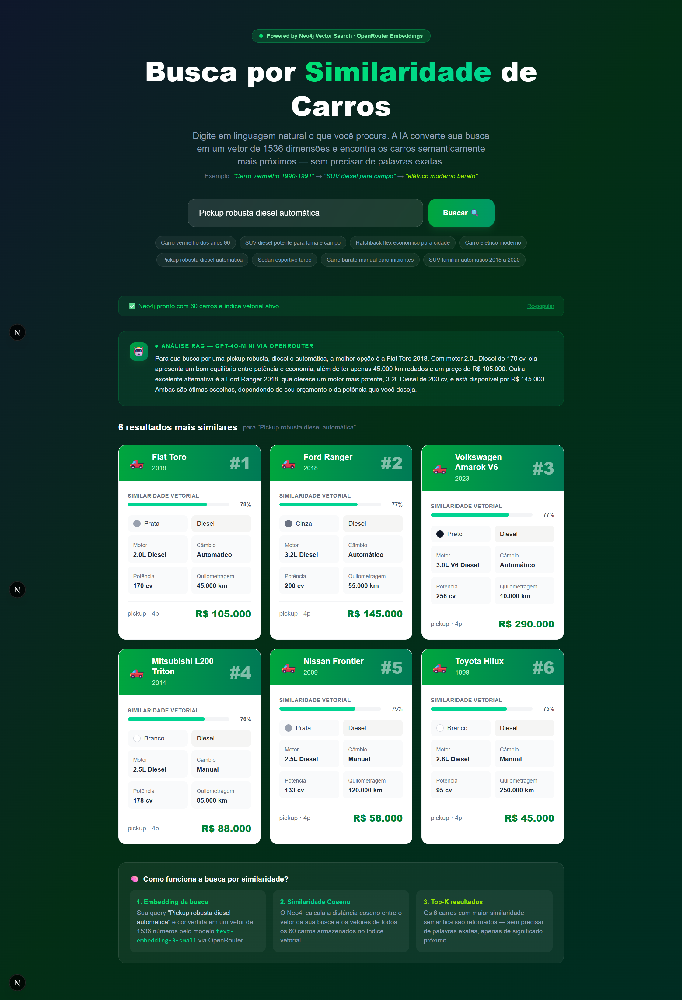

# 🚗 Busca RAG de Carros

Aplicação de **RAG (Retrieval-Augmented Generation)** com busca vetorial por linguagem natural, usando Neo4j, embeddings + LLM via OpenRouter e Next.js.

> **Objetivo pedagógico:** Demonstrar o pipeline RAG completo — o usuário digita em português natural, a IA recupera os carros semanticamente mais próximos (Retrieval) e um LLM gera uma resposta contextualizada com base nesses dados reais (Generation).



---

## 🧠 Pipeline RAG

```
Usuário digita query
        │
        ▼
[R] OpenRouter — text-embedding-3-small
        │  vetor de 1536 dimensões
        ▼
[R] Neo4j — busca vetorial (similaridade coseno)
        │  top-6 carros do banco
        ▼
[A] Prompt aumentado com contexto dos carros recuperados
        │
        ▼
[G] OpenRouter — gpt-4o-mini
        │  resposta em linguagem natural
        ▼
Interface Next.js — resposta IA + cards dos carros
```

| Etapa      | Sigla | Tecnologia         | O que faz                                                     |
| ---------- | ----- | ------------------ | ------------------------------------------------------------- |
| Retrieval  | **R** | Neo4j + embeddings | Busca vetorial — traz os carros reais mais similares          |
| Augmented  | **A** | Prompt engineering | Injeta os dados recuperados no contexto do LLM                |
| Generation | **G** | gpt-4o-mini        | Gera resposta natural baseada _somente_ nos dados recuperados |

> O LLM **não inventa carros** — ele só interpreta e comunica o que o Neo4j já buscou.

---

## 🛠️ Stack

- **Next.js 16** (App Router, Server Components) + **Tailwind CSS v4**
- **Neo4j 5.18** — banco de grafos com índice vetorial nativo (`db.index.vector`)
- **OpenRouter** — embeddings (`text-embedding-3-small`, 1536 dims) + chat (`gpt-4o-mini`)
- **Docker** — container Neo4j com plugin APOC
- **TypeScript** — tipagem completa em todo o projeto

---

## ⚡ Setup Rápido

### 1. Pré-requisitos

- Node.js 18+
- Docker + Docker Compose
- Conta no [OpenRouter](https://openrouter.ai) com créditos

### 2. Subir Neo4j com Docker

```bash
docker-compose up -d
```

Neo4j disponível em:

- Browser: http://localhost:7474 (login: `neo4j` / `password123`)
- Bolt: `bolt://localhost:7687`

### 3. Configurar variáveis de ambiente

Edite o arquivo `.env.local`:

```env
NEO4J_URI=bolt://localhost:7687
NEO4J_USER=neo4j
NEO4J_PASSWORD=password123
OPENROUTER_API_KEY=sk-or-v1-xxxxxxxx
NEXT_PUBLIC_APP_URL=http://localhost:3000
```

### 4. Instalar dependências e rodar

```bash
yarn install
yarn dev
```

Acesse: **http://localhost:3000**

### 5. Popular o banco (primeira vez)

Na interface, clique em **"🗄️ Popular Banco"**. Isso vai:

1. Criar o índice vetorial no Neo4j (`car_embeddings`, 1536 dims, coseno)
2. Gerar embeddings para cada um dos 60 carros via OpenRouter
3. Inserir os carros com seus vetores no Neo4j

⏱️ _Leva ~2-3 min (lotes de 20 carros)_

---

## 🔍 Como usar

Digite qualquer descrição em linguagem natural:

- `Carro vermelho dos anos 90-91`
- `SUV diesel potente para campo e lama`
- `Sedan esportivo turbo preto automático`
- `Carro elétrico moderno econômico`
- `Pickup robusta para trabalho pesado`

A aplicação retorna:

1. **Resposta do LLM** — análise contextualizada com base nos carros recuperados
2. **Cards dos carros** — os 6 mais similares com barra de similaridade vetorial

---

## 💡 Por que busca por similaridade é melhor?

| Busca tradicional                          | Busca por similaridade semântica        |
| ------------------------------------------ | --------------------------------------- |
| Precisa de palavras exatas                 | Entende sinônimos e contexto            |
| `"vermelho"` não encontra `"cor vermelha"` | Encontra carros semanticamente próximos |
| Filtros rígidos por campo                  | Busca em qualquer dimensão semântica    |
| Não entende intenção                       | `"bom para família"` → SUV espaçoso     |

---

## 📁 Estrutura do projeto

```
src/
├── app/
│   ├── page.tsx                        # Server Component — verifica seed no load
│   ├── layout.tsx
│   └── api/
│       ├── seed/route.ts               # POST: popula Neo4j; GET: verifica status
│       └── search/route.ts             # POST: embedding → Neo4j → LLM → resposta RAG
│
├── services/                           # Camada de serviços (sem acoplamento a framework)
│   ├── neo4j.ts                        # Driver singleton + runQuery<T>
│   ├── embeddings.ts                   # generateEmbedding / generateEmbeddingsBatch
│   └── llm.ts                          # generateRagResponse (gpt-4o-mini via OpenRouter)
│
├── features/
│   └── cars/
│       ├── types.ts                    # Interface CarResult
│       └── components/
│           ├── CarCard/                # Card de resultado individual
│           │   ├── CarCard.tsx
│           │   ├── CarCard.types.ts
│           │   ├── CarCard.constants.ts
│           │   ├── index.ts
│           │   └── components/
│           │       └── SimilarityBar/ # Barra de progresso com score vetorial
│           └── CarSearch/             # Orquestrador principal da busca
│               ├── CarSearch.tsx      # UI lean (~45 linhas)
│               ├── CarSearch.types.ts
│               ├── CarSearch.constants.ts
│               ├── useCarSearch.ts    # Toda a lógica de estado
│               ├── index.ts
│               └── components/        # Sub-componentes (folder-per-component)
│                   ├── AiResponse/    # Banner com resposta gerada pelo LLM
│                   ├── SearchHero/
│                   ├── SearchForm/
│                   ├── ExampleQueries/
│                   ├── SeedBanner/
│                   ├── SearchResults/
│                   ├── TechExplanation/
│                   └── EmptyState/
│
└── lib/
    ├── neo4j.ts                        # Re-export de services/neo4j
    ├── embeddings.ts                   # Re-export de services/embeddings
    └── cars-data.ts                    # Dataset estático de 60 carros (1990–2024)

docker-compose.yml                      # Neo4j 5.18 com APOC
.env.local                              # Variáveis de ambiente (não comitar)
```

---

## 🏗️ Decisões de arquitetura

- **Screaming Architecture** — pastas organizadas por `features/` e `services/`, não por tipo de arquivo
- **Server Components** — `page.tsx` verifica seed no servidor, sem loading state no cliente
- **Folder-per-component** — cada componente em pasta própria com `.types.ts`, `.constants.ts` e hooks separados
- **Falha silenciosa no LLM** — se o `gpt-4o-mini` falhar, os cards ainda aparecem (o Retrieval não depende do Generation)
- **Re-exports em `lib/`** — mantidos para compatibilidade com imports existentes
