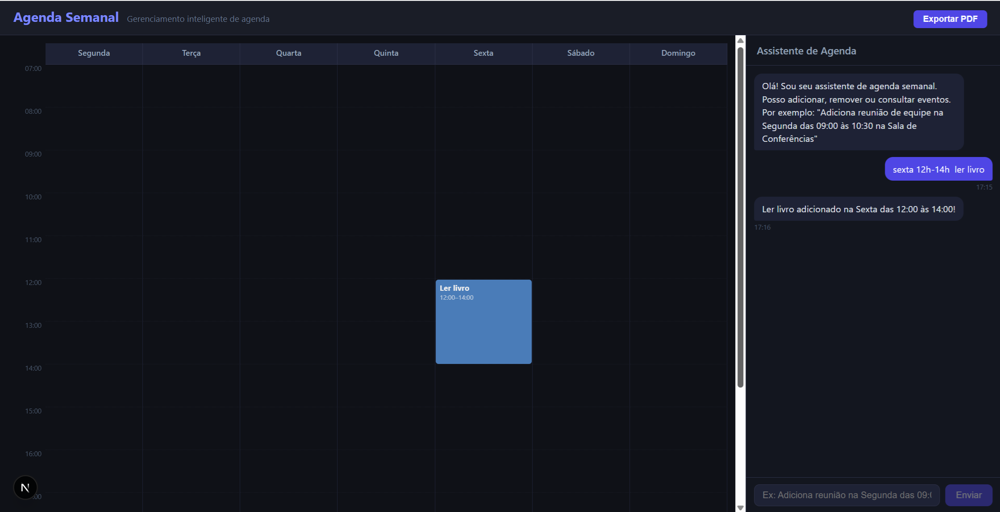
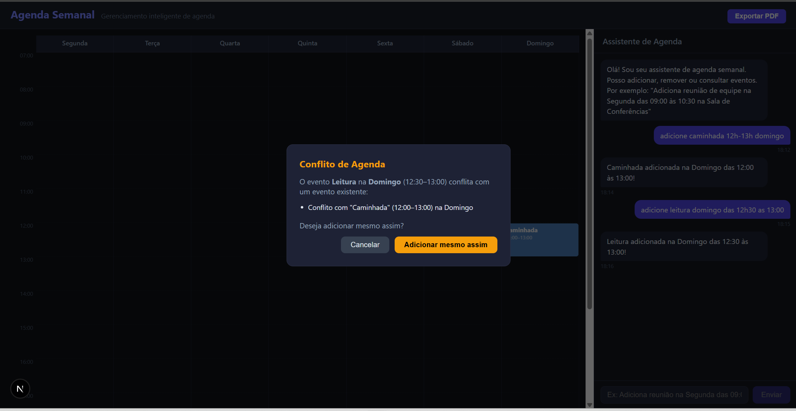

# WeeklyScheduler — Agenda Semanal com IA

Aplicação web de gerenciamento de agenda semanal com assistente de IA conversacional, guardrails de segurança e exportação de PDF. Desenvolvido como projeto prático da Pós-Graduação em IA Aplicada.

---

## Demonstração





---

## Sobre o Projeto

O WeeklyScheduler é um gerenciador de agenda inteligente onde o usuário interage em linguagem natural para adicionar e remover eventos. O sistema processa o pedido com um pipeline de IA baseado em **LangGraph**, valida a segurança da mensagem com um nó de guardrails antes de executar qualquer ação, e reflete o resultado imediatamente no calendário visual.

O diferencial técnico é a arquitetura em grafo de estados do LangGraph, que permite separar responsabilidades em nós independentes e definir rotas condicionais entre eles — padrão fundamental para construir agentes de IA confiáveis e controláveis.

---

## Funcionalidades

- **Chat em linguagem natural** — adicione e remova eventos conversando (ex: _"adicione caminhada quarta 10h-12h"_)
- **Calendário semanal visual** — grade CSS de Segunda a Domingo, 07h às 20h, com eventos coloridos por posição de horário
- **Detecção de conflitos** — ao adicionar um evento que se sobreponha a outro, um modal pergunta se deseja forçar o agendamento
- **Guardrails de segurança** — nó dedicado que classifica cada mensagem antes de processar, bloqueando conteúdo fora do escopo ou tentativas de jailbreak
- **Remoção por linguagem natural** — _"remova a reunião"_ remove o evento correspondente sem precisar clicar no calendário
- **Exportação para PDF** — botão no cabeçalho captura o calendário em alta resolução e gera um arquivo PDF landscape
- **Renderização de markdown** — textos `**negrito**` do LLM são exibidos como negrito real na interface

---

## Arquitetura

### Stack Tecnológico

| Camada             | Tecnologia                                    |
| ------------------ | --------------------------------------------- |
| Frontend           | Next.js 15 (App Router), React 18, TypeScript |
| LLM local          | Ollama (`llama3.2`) via `@langchain/ollama`   |
| Orquestração de IA | LangGraph `@langchain/langgraph`              |
| Geração de PDF     | `jspdf` + `html2canvas`                       |
| Estilização        | CSS puro com CSS Grid                         |

### Pipeline LangGraph

O coração do sistema é um grafo de estados com roteamento condicional:

```
START
  │
  ▼
guardrails_check  ←── verifica se a mensagem é segura e relevante
  │
  ├── safe: true  ──► chat  ──► extrai ação JSON e responde
  │
  └── safe: false ──► blocked  ──► retorna mensagem de bloqueio em PT
                                         │
                                        END
```

**Nós do grafo:**

- **`guardrailsCheckNode`** — envia a mensagem para o LLM com um prompt específico de classificação. Retorna `{"safe": true}` ou `{"safe": false, "reason": "..."}`. Bloqueia pedidos fora do contexto de agenda, tentativas de jailbreak e conteúdo inapropriado.

- **`chatNode`** — recebe o histórico completo da conversa e um system prompt com exemplos few-shot. Instrui o modelo a executar a ação imediatamente (sem pedir confirmação) e retornar um bloco JSON estruturado junto com a resposta amigável.

- **`blockedNode`** — retorna uma mensagem padrão em português informando que o pedido não pode ser atendido.

### Fluxo de Dados Frontend

```
useChat (hook)
  │
  ├── envia mensagem → POST /api/chat
  │     └── buildSchedulerGraph().invoke(...)
  │           └── retorna { message, pendingEvento, scheduleAction }
  │
  ├── pendingEvento → onEventoDetectado → useScheduler.adicionarEvento()
  │     └── detecta conflito → abre ConflictModal
  │           ├── confirmar → forcarAdicionar()
  │           └── cancelar → descartarConflito()
  │
  └── scheduleAction (remove) → onRemoverQuery → useScheduler.removerEventoPorQuery()
```

### Estrutura de Pastas

```
src/
├── app/
│   ├── api/chat/route.ts            # Endpoint POST — invoca o grafo LangGraph
│   ├── components/
│   │   │
│   │   ├── WeeklyCalendar.tsx        # re-export (compatibilidade de imports)
│   │   ├── WeeklyCalendar/
│   │   │   ├── index.tsx             # Orquestrador: compõe os sub-componentes
│   │   │   ├── CalendarDayHeaders.tsx# SRP: cabeçalhos dos dias da semana
│   │   │   ├── CalendarTimeLabels.tsx# SRP: labels de horário (07:00–20:00)
│   │   │   ├── CalendarGridCells.tsx # SRP: células de fundo do grid
│   │   │   ├── EventSlot.tsx         # SRP: um evento com botão de remover
│   │   │   ├── constants.ts          # DIAS, HORAS, CORES
│   │   │   └── helpers.ts            # horaParaLinha, duracaoParaSpan
│   │   │
│   │   ├── ChatPanel.tsx             # re-export (compatibilidade de imports)
│   │   ├── ChatPanel/
│   │   │   ├── index.tsx             # Orquestrador: header + lista + input
│   │   │   ├── ChatMessageList.tsx   # SRP: lista de mensagens + auto-scroll
│   │   │   ├── ChatBubble.tsx        # SRP: bolha individual + markdown bold
│   │   │   ├── ChatInput.tsx         # SRP: formulário com estado de input
│   │   │   ├── TypingIndicator.tsx   # SRP: animação de digitação (3 pontos)
│   │   │   └── helpers.ts            # stripAndNormalizeContent
│   │   │
│   │   ├── ConflictModal.tsx         # re-export (compatibilidade de imports)
│   │   └── ConflictModal/
│   │       └── index.tsx             # Modal de conflito de horário
│   │
│   ├── hooks/
│   │   ├── useChat.ts               # Gerencia mensagens e chama a API
│   │   └── useScheduler.ts          # Estado da agenda, conflitos e operações CRUD
│   ├── globals.css                  # Tema escuro + layout em flexbox/grid
│   ├── layout.tsx
│   └── page.tsx                     # Página principal com botão de exportar PDF
├── core/
│   └── graph/
│       ├── graph.ts                 # Definição do StateGraph LangGraph
│       ├── state.ts                 # SchedulerStateAnnotation (mensagens + metadados)
│       └── nodes/
│           ├── guardrailsCheckNode.ts
│           ├── chatNode.ts
│           ├── blockedNode.ts
│           └── edgeConditions.ts
├── lib/
│   └── gemini.ts                    # Fábrica do ChatOllama (nome histórico mantido)
└── types/
    └── index.ts                     # Tipos: Evento, AgendaSemanal, ConflictInfo, etc.
```

**Convenção de componentes (SOLID):** cada componente tem sua própria pasta com `index.tsx` como ponto de entrada. Arquivos de lógica pura ficam em `helpers.ts` e constantes em `constants.ts`. Componentes complexos são divididos em sub-componentes, cada um com responsabilidade única (SRP).

---

## Como Executar

### Pré-requisitos

- Node.js 18+
- [Ollama](https://ollama.com) instalado e rodando localmente

### 1. Instalar o modelo Ollama

```bash
ollama pull llama3.2
```

Verifique se o Ollama está rodando em `http://localhost:11434`.

### 2. Instalar as dependências

```bash
cd WeeklyScheduler
npm install
```

### 3. Configurar o ambiente

O arquivo `.env.local` já está configurado para o Ollama local:

```env
OLLAMA_BASE_URL=http://localhost:11434
OLLAMA_MODEL=llama3.2
```

Para usar outro modelo instalado (ex: `qwen3:8b`, `phi3`), basta alterar `OLLAMA_MODEL`.

### 4. Iniciar o servidor

```bash
npm run dev
```

Acesse [http://localhost:3000](http://localhost:3000).

---

## Exemplos de Uso

| Comando                                 | Resultado                                            |
| --------------------------------------- | ---------------------------------------------------- |
| `adicione caminhada quarta 10h-12h`     | Cria evento "Caminhada" na Quarta das 10:00 às 12:00 |
| `reunião de equipe segunda 9h às 10h30` | Cria evento "Reunião de equipe" na Segunda           |
| `adiciona almoço sexta 12h-13h30`       | Cria evento "Almoço" na Sexta                        |
| `remova a caminhada`                    | Remove todos os eventos com "caminhada" no título    |
| `o que tenho na quarta?`                | Responde com os eventos do dia (conversacional)      |

---

## Conceitos Aplicados

- **LangGraph** — orquestração de agentes com grafo de estados e roteamento condicional
- **Guardrails** — validação de segurança por LLM antes de qualquer ação, padrão fundamental em sistemas de IA em produção
- **Few-shot prompting** — exemplos de input/output no system prompt para guiar modelos locais menores
- **LLM local com Ollama** — execução 100% offline, sem custo de API e sem envio de dados para servidores externos
- **React hooks customizados** — separação de estado da agenda (`useScheduler`) e lógica de chat (`useChat`)
- **CSS Grid** — calendário construído inteiramente com CSS Grid nativo, sem bibliotecas de calendário
- **SOLID / SRP** — cada componente React tem uma única responsabilidade; componentes grandes divididos em sub-componentes focados (headers, grid, event slot, bubble, input, typing indicator)
- **Barrel exports** — arquivos `.tsx` raiz como re-exports transparentes, mantendo compatibilidade de imports sem alterar consumidores existentes

---

_Projeto desenvolvido como parte da Pós-Graduação em IA Aplicada — Aula 2, Módulos 1–5_
