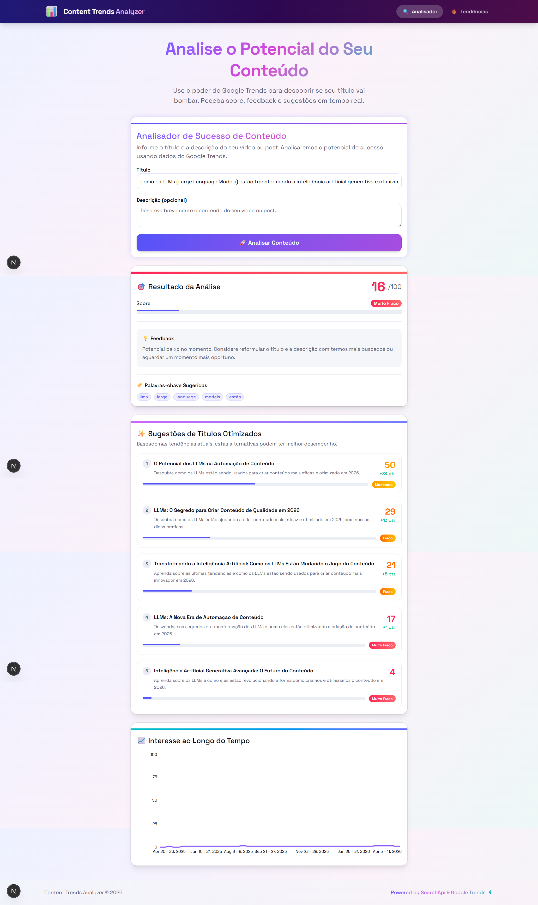
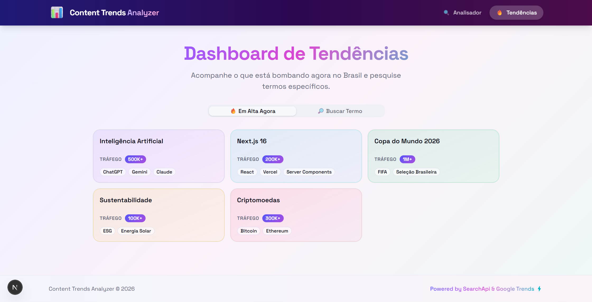
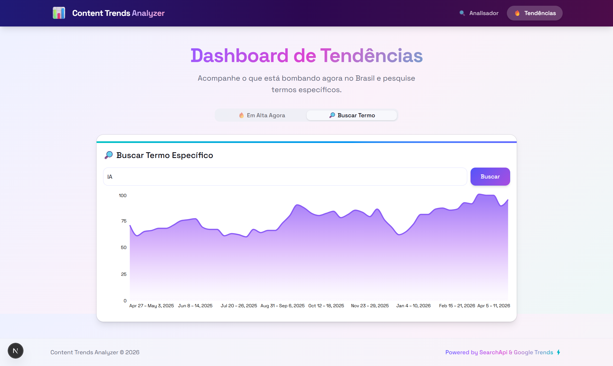

# 📊 Content Trends Analyzer

Aplicação Next.js que analisa títulos e descrições de conteúdo usando dados do Google Trends, retornando um score de potencial viral (0-100), feedback, palavras-chave sugeridas e sugestões de títulos otimizados gerados por IA local (Ollama).

## ✨ Features

- Análise de potencial viral de títulos e descrições usando Google Trends
- Score de 0 a 100 com feedback detalhado e palavras-chave em alta
- Sugestões de títulos otimizados gerados via LLM local (Ollama)
- Score real de cada sugestão baseado em dados do Google Trends
- Dashboard de tendências com termos em alta no Brasil
- Busca de interesse ao longo do tempo para qualquer termo
- Gráficos interativos de interesse com Recharts
- UI moderna com tema violet/rose, animações e design responsivo
- 85 testes unitários e de integração com Vitest



## 🛠️ Tech Stack

| Categoria   | Tecnologia                             |
| ----------- | -------------------------------------- |
| Framework   | Next.js 16.2.3 (App Router, Turbopack) |
| UI          | React 19, TypeScript 5, Tailwind CSS 4 |
| Componentes | Shadcn/UI (Base UI), Lucide Icons      |
| Estado      | Zustand 5                              |
| Gráficos    | Recharts 3                             |
| HTTP        | Axios                                  |
| IA Local    | Ollama (llama3.2)                      |
| API Externa | SearchApi (Google Trends)              |
| Testes      | Vitest 2, Testing Library, happy-dom   |
| Fontes      | Space Grotesk, JetBrains Mono          |

## 📁 Arquitetura

Screaming Architecture organizada por features, com separação clara de componentes, serviços, estado e utilitários.

```
src/
├── app/                  # Páginas e API routes
│   ├── api/
│   │   ├── analyze/      # POST — análise de conteúdo
│   │   └── trends/       # GET — tendências e busca
│   ├── trends/           # Dashboard de tendências
│   ├── layout.tsx        # Layout raiz (fonts, navbar, footer)
│   └── page.tsx          # Página principal (hero + analyzer)
├── features/
│   ├── analyzer/         # Feature de análise de conteúdo
│   │   ├── components/   # AnalyzerForm, ScoreDisplay, SuggestionsDisplay
│   │   └── services/     # analyzeContent (core + Ollama)
│   ├── trends/           # Feature de tendências
│   │   ├── components/   # TrendingList, TrendSearch
│   │   └── services/     # trendsService
│   └── shared/           # TrendChart compartilhado
├── components/
│   ├── common/           # Navbar, Footer
│   └── ui/               # Shadcn/Base UI primitives
├── store/                # Zustand store (useAppStore)
├── hooks/                # useDebounce
├── utils/                # formatting (score, cores, datas)
└── lib/                  # Clients externos (SearchApi, Ollama)
tests/
├── api/                  # Testes de API routes
├── components/           # Testes de componentes React
├── services/             # Testes unitários e de integração
├── store/                # Testes da Zustand store
└── utils/                # Testes de utilitários
```

## 🚀 Getting Started

### Pré-requisitos

- Node.js 20+
- npm
- [Ollama](https://ollama.com/) instalado localmente

### Instalação

```bash
# Clonar o repositório
git clone <url-do-repo>
cd content-trends-analyzer

# Instalar dependências
npm install

# Baixar o modelo do Ollama
ollama pull llama3.2

# Configurar variáveis de ambiente
cp .env.local.example .env.local
# Editar .env.local com sua chave da SearchApi

# Iniciar o servidor de desenvolvimento
npm run dev
```

### Variáveis de Ambiente

| Variável         | Descrição                                                          | Obrigatório |
| ---------------- | ------------------------------------------------------------------ | ----------- |
| `SEARCH_API_KEY` | Chave da [SearchApi](https://www.searchapi.io/) para Google Trends | Sim         |
| `OLLAMA_HOST`    | URL do servidor Ollama (default: `http://localhost:11434`)         | Não         |
| `OLLAMA_MODEL`   | Modelo do Ollama para sugestões (default: `llama3.2`)              | Não         |

## 📡 API Routes

| Método | Rota                    | Descrição                                                                                            |
| ------ | ----------------------- | ---------------------------------------------------------------------------------------------------- |
| POST   | `/api/analyze`          | Recebe `{ title, description }`, retorna score, feedback, keywords, trendData e sugestões via Ollama |
| GET    | `/api/trends`           | Retorna top 20 termos em alta no Brasil                                                              |
| GET    | `/api/trends/search?q=` | Retorna dados de interesse ao longo do tempo para um termo                                           |

## 📄 Páginas

| Rota      | Descrição                                                                          |
| --------- | ---------------------------------------------------------------------------------- |
| `/`       | Hero com formulário de análise, score, sugestões de títulos e gráfico de tendência |
| `/trends` | Dashboard com tabs: termos em alta no Brasil e busca por termo com gráfico         |

### Tendências — Em Alta Agora



### Tendências — Buscar Termo



## 🧩 Componentes Principais

| Componente           | Descrição                                                                   |
| -------------------- | --------------------------------------------------------------------------- |
| `AnalyzerForm`       | Formulário de título/descrição, chama API e exibe resultados                |
| `ScoreDisplay`       | Card de score (0-100) com barra de progresso, feedback e badges de keywords |
| `SuggestionsDisplay` | 5 sugestões de títulos otimizados com score e diferença de pontos           |
| `TrendChart`         | Gráfico de área com gradiente mostrando interesse ao longo do tempo         |
| `TrendingList`       | Grid de cards com termos em alta, tráfego e queries relacionadas            |
| `TrendSearch`        | Campo de busca + gráfico de interesse para qualquer termo                   |
| `Navbar`             | Header fixo com navegação animada entre páginas                             |
| `Footer`             | Rodapé com créditos                                                         |

## 🤖 Agentes & Skills

### Agentes (`.github/agents/`)

| Agente      | Descrição                                                     |
| ----------- | ------------------------------------------------------------- |
| `@readme`   | Regenera o README.md quando o código muda                     |
| `@llms-txt` | Regenera o `public/llms.txt` seguindo a spec llms.txt         |
| `@debug`    | Modo debug para identificação e resolução sistemática de bugs |

### Skills (`.agents/skills/`)

| Skill                  | Descrição                                   |
| ---------------------- | ------------------------------------------- |
| `frontend-code-review` | Checklist de review para arquivos frontend  |
| `frontend-design`      | Padrões de design frontend                  |
| `next-best-practices`  | Convenções e best practices do Next.js 16   |
| `shadcn-ui`            | Padrões de componentes Shadcn/Base UI       |
| `unit-test-generator`  | Geração de testes unitários com AAA pattern |

## 🧪 Testes

85 testes unitários e de integração com Vitest + Testing Library.

| Arquivo                                             | Testes | Cobertura                                                                   |
| --------------------------------------------------- | ------ | --------------------------------------------------------------------------- |
| `tests/utils/formatting.test.ts`                    | 18     | formatScore, scoreColor, scoreBg, formatDate                                |
| `tests/store/useAppStore.test.ts`                   | 11     | Estado inicial, actions do Zustand                                          |
| `tests/services/analyzeContent.test.ts`             | 33     | extractKeywords, calculateScore, generateFeedback, extractTopic, capitalize |
| `tests/services/analyzeContent.integration.test.ts` | 5      | analyzeContent com SearchApi e Ollama mockados                              |
| `tests/api/analyze.test.ts`                         | 4      | POST /api/analyze com validações                                            |
| `tests/components/ScoreDisplay.test.tsx`            | 7      | Renderização de score, feedback, keywords                                   |
| `tests/components/SuggestionsDisplay.test.tsx`      | 7      | Renderização de sugestões com títulos e scores                              |

```bash
npm test          # Rodar todos os testes
npm run test:watch  # Modo watch
```

## 📝 Scripts

| Comando              | Descrição                                 |
| -------------------- | ----------------------------------------- |
| `npm run dev`        | Servidor de desenvolvimento com Turbopack |
| `npm run build`      | Build de produção                         |
| `npm run start`      | Servidor de produção                      |
| `npm run lint`       | Linting com ESLint                        |
| `npm test`           | Rodar todos os testes                     |
| `npm run test:watch` | Testes em modo watch                      |
