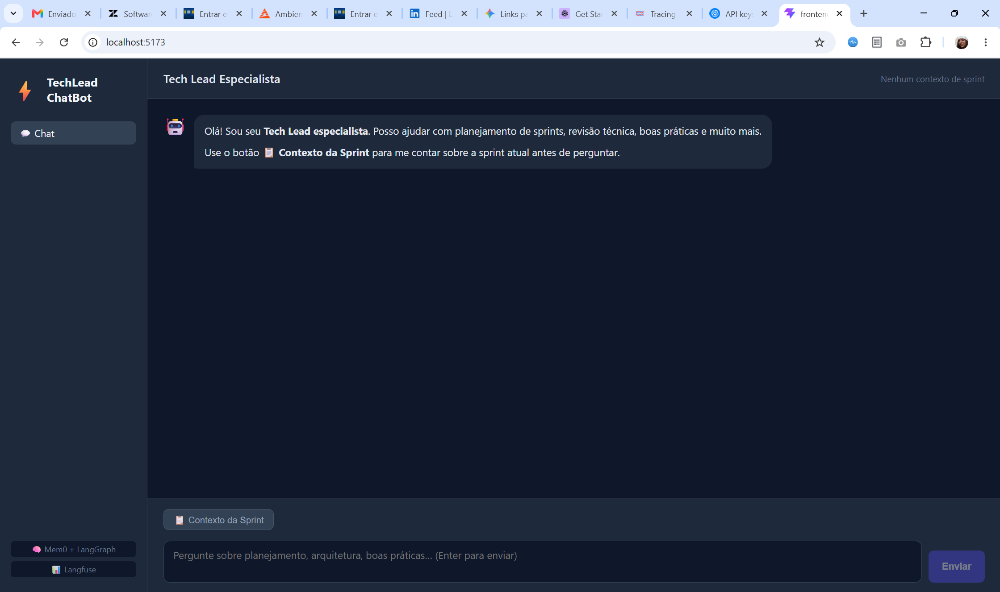
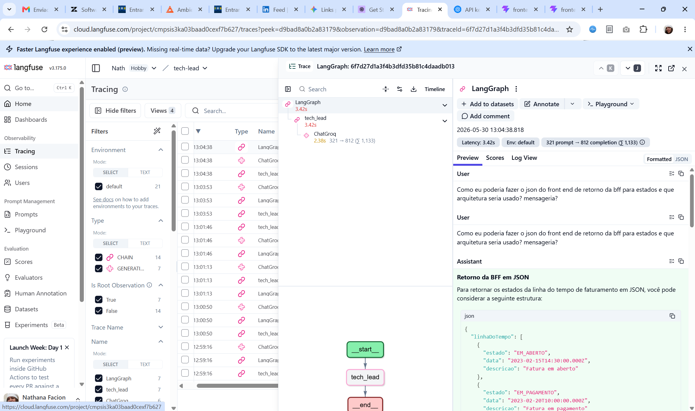

# TechLead ChatBot

Agente especialista em Tech Lead com memória de longo prazo por sprint.



---

## Serviços utilizados

### 🤖 OpenAI — [platform.openai.com](https://platform.openai.com)

Fornece o modelo de linguagem (GPT-4o) que alimenta o agente Tech Lead. É responsável por processar as perguntas, analisar o contexto das sprints e gerar respostas inteligentes sobre planejamento, arquitetura e boas práticas de desenvolvimento. Toda a inteligência conversacional do agente vem da API da OpenAI.

### 🧠 Mem0 — [app.mem0.ai](https://app.mem0.ai)

Camada de **memória de longo prazo** do agente. Armazena o histórico de cada interação por usuário e, a cada nova conversa, busca automaticamente os contextos mais relevantes das sprints passadas. Com isso, o agente aprende com o tempo — melhorando suas recomendações e planejamentos conforme mais sprints são informadas.

### 📊 Langfuse — [cloud.langfuse.com](https://cloud.langfuse.com)

Plataforma de **observabilidade e rastreamento** para aplicações com LLMs. Registra automaticamente cada execução do agente: prompts enviados, respostas recebidas, latência e custo de tokens. Permite monitorar e depurar o comportamento do agente em produção através de um dashboard visual.



---

## Stack

- **Frontend:** React + Vite
- **Backend:** Python, FastAPI, LangGraph, Langfuse, Mem0

## Configuração

### 1. Backend

```bash
cd backend
cp .env.example .env
# Edite o .env com suas chaves de API
.venv\Scripts\activate        # Windows
pip install -r requirements.txt
uvicorn main:app --reload
```

### 2. Frontend

```bash
cd frontend
cp .env.example .env
npm install
npm run dev
```

## Chaves necessárias (.env do backend)

| Variável              | Onde obter                  |
| --------------------- | --------------------------- |
| `OPENAI_API_KEY`      | https://platform.openai.com |
| `LANGFUSE_PUBLIC_KEY` | https://cloud.langfuse.com  |
| `LANGFUSE_SECRET_KEY` | https://cloud.langfuse.com  |
| `MEM0_API_KEY`        | https://app.mem0.ai         |

## Como usar

1. Inicie o backend (`uvicorn main:app --reload`) na porta 8000
2. Inicie o frontend (`npm run dev`) na porta 5173
3. Acesse http://localhost:5173
4. (Opcional) Clique em **📋 Contexto da Sprint** para fornecer dados da sprint atual
5. Faça perguntas ao agente — ele aprende e acumula memória entre conversas
