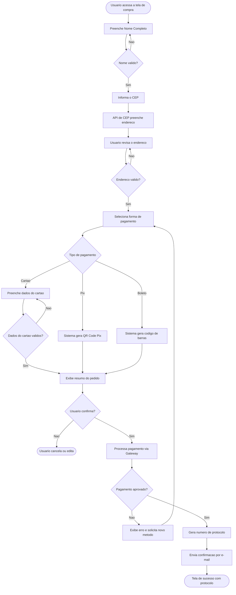

# Especificação Técnica — Tela de Cadastro para Compra de Item

## 🎯 1. Entendimento do Problema e Escopo

O sistema deve disponibilizar uma tela de cadastro simplificada para o fluxo de compra de um item em uma loja virtual. O escopo cobre a coleta de dados do comprador (identificação, endereço de entrega e forma de pagamento), validação das informações e confirmação do pedido. A solução deve ser leve e guiar o usuário até a finalização sem etapas desnecessárias.

---

## ⚙️ 2. Requisitos Funcionais (RF)

**Módulo: Identificação**

- **RF001:** O sistema deve permitir que o usuário informe seu nome completo.
- **RF002:** O sistema deve validar que o campo nome contém ao menos nome e sobrenome antes de avançar.

**Módulo: Endereço de Entrega**

- **RF003:** O sistema deve permitir que o usuário informe o endereço de entrega (logradouro, número, complemento, bairro, cidade, estado e CEP).
- **RF004:** O sistema deve consultar e preencher automaticamente os campos de endereço ao usuário digitar o CEP válido.
- **RF005:** O sistema deve validar que todos os campos obrigatórios do endereço foram preenchidos antes de avançar.

**Módulo: Pagamento**

- **RF006:** O sistema deve permitir que o usuário selecione a forma de pagamento (cartão de crédito, boleto ou Pix).
- **RF007:** O sistema deve exibir o formulário de dados do cartão (número, nome, validade e CVV) quando selecionado "cartão de crédito".
- **RF008:** O sistema deve gerar e exibir o QR Code Pix ou código de barras do boleto conforme a forma selecionada.
- **RF009:** O sistema deve mascarar os dados sensíveis do cartão durante a digitação (ex: `**** **** **** 1234`).

**Módulo: Confirmação**

- **RF010:** O sistema deve exibir um resumo do pedido antes da confirmação final.
- **RF011:** O sistema deve gerar e exibir um número de protocolo após a submissão bem-sucedida.
- **RF012:** O sistema deve enviar confirmação ao e-mail do usuário após a finalização.

---

## 🔒 3. Requisitos Não-Funcionais (RNF)

- **RNF001 (Segurança):** Os dados de pagamento devem ser tokenizados via gateway (ex: Stripe, PagSeguro) e nunca armazenados no servidor da aplicação.
- **RNF002 (Segurança):** Toda comunicação deve utilizar HTTPS/TLS 1.2 ou superior.
- **RNF003 (Performance):** A consulta de CEP deve retornar os dados em no máximo 1 segundo após a digitação do último dígito.
- **RNF004 (Performance):** O tempo de resposta para confirmação do pedido não deve ultrapassar 3 segundos em condições normais de uso.
- **RNF005 (Usabilidade):** O formulário deve ser responsivo em dispositivos com tela a partir de 320px.
- **RNF006 (Usabilidade):** Mensagens de erro de validação devem aparecer inline em no máximo 200ms após saída do foco.
- **RNF007 (Disponibilidade):** O sistema de checkout deve ter disponibilidade mínima de 99,5% ao mês.
- **RNF008 (Conformidade):** O tratamento de dados pessoais deve estar em conformidade com a LGPD (Lei 13.709/2018).

---

## 📊 4. Diagrama de Funcionamento (Mermaid)

![Diagrama de Funcionamento](https://mermaid.ink/img/Z3JhcGggVEQKICAgIEEoW1VzdWFyaW8gYWNlc3NhIGEgdGVsYSBkZSBjb21wcmFdKSAtLT4gQltQcmVlbmNoZSBOb21lIENvbXBsZXRvXQogICAgQiAtLT4gQ3siTm9tZSB2YWxpZG8_In0KICAgIEMgLS0gTmFvIC0tPiBCCiAgICBDIC0tIFNpbSAtLT4gRFtJbmZvcm1hIG8gQ0VQXQogICAgRCAtLT4gRVtBUEkgZGUgQ0VQIHByZWVuY2hlIGVuZGVyZWNvXQogICAgRSAtLT4gRltVc3VhcmlvIHJldmlzYSBvIGVuZGVyZWNvXQogICAgRiAtLT4gR3siRW5kZXJlY28gdmFsaWRvPyJ9CiAgICBHIC0tIE5hbyAtLT4gRgogICAgRyAtLSBTaW0gLS0-IEhbU2VsZWNpb25hIGZvcm1hIGRlIHBhZ2FtZW50b10KICAgIEggLS0-IEl7IlRpcG8gZGUgcGFnYW1lbnRvIn0KICAgIEkgLS0gQ2FydGFvIC0tPiBKW1ByZWVuY2hlIGRhZG9zIGRvIGNhcnRhb10KICAgIEkgLS0gUGl4IC0tPiBLW1Npc3RlbWEgZ2VyYSBRUiBDb2RlIFBpeF0KICAgIEkgLS0gQm9sZXRvIC0tPiBMW1Npc3RlbWEgZ2VyYSBjb2RpZ28gZGUgYmFycmFzXQogICAgSiAtLT4gTXsiRGFkb3MgZG8gY2FydGFvIHZhbGlkb3M_In0KICAgIE0gLS0gTmFvIC0tPiBKCiAgICBNIC0tIFNpbSAtLT4gTltFeGliZSByZXN1bW8gZG8gcGVkaWRvXQogICAgSyAtLT4gTgogICAgTCAtLT4gTgogICAgTiAtLT4gT3siVXN1YXJpbyBjb25maXJtYT8ifQogICAgTyAtLSBOYW8gLS0-IFAoW1VzdWFyaW8gY2FuY2VsYSBvdSBlZGl0YV0pCiAgICBPIC0tIFNpbSAtLT4gUVtQcm9jZXNzYSBwYWdhbWVudG8gdmlhIEdhdGV3YXldCiAgICBRIC0tPiBSeyJQYWdhbWVudG8gYXByb3ZhZG8_In0KICAgIFIgLS0gTmFvIC0tPiBTW0V4aWJlIGVycm8gZSBzb2xpY2l0YSBub3ZvIG1ldG9kb10KICAgIFMgLS0-IEgKICAgIFIgLS0gU2ltIC0tPiBUW0dlcmEgbnVtZXJvIGRlIHByb3RvY29sb10KICAgIFQgLS0-IFVbRW52aWEgY29uZmlybWFjYW8gcG9yIGUtbWFpbF0KICAgIFUgLS0-IFYoW1RlbGEgZGUgc3VjZXNzbyBjb20gcHJvdG9jb2xvXSk)

